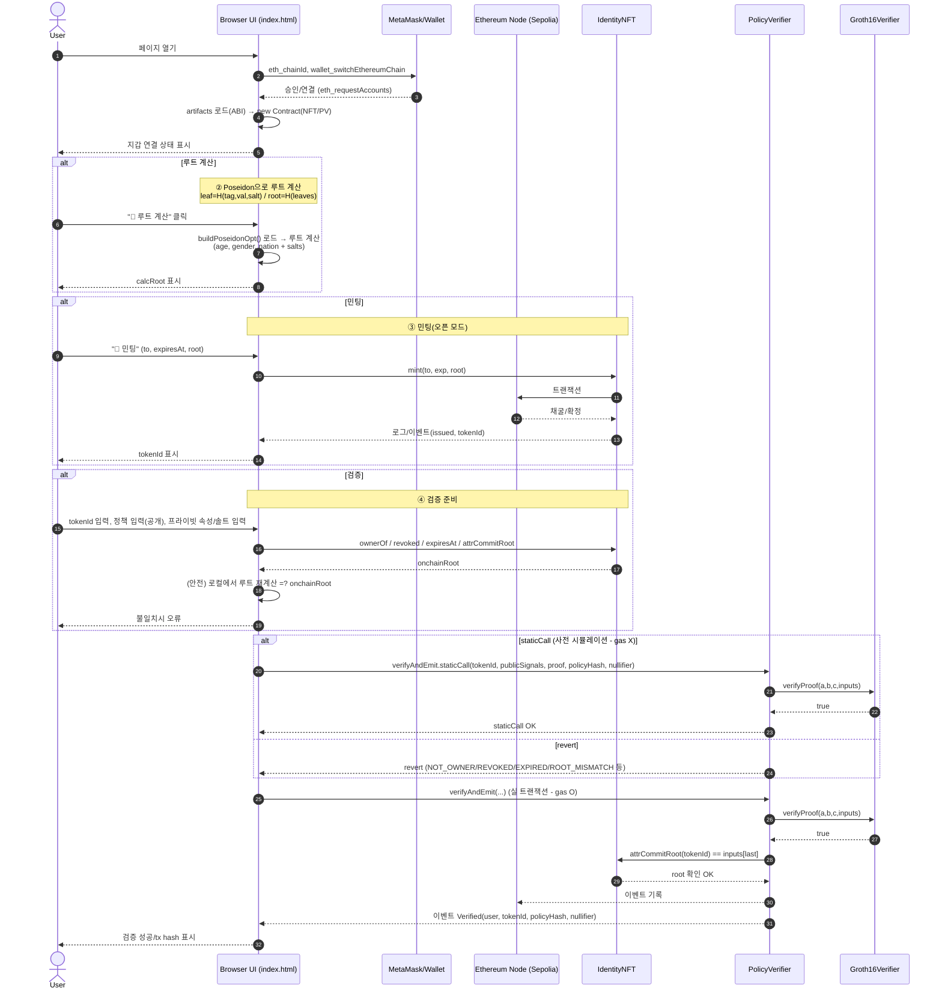
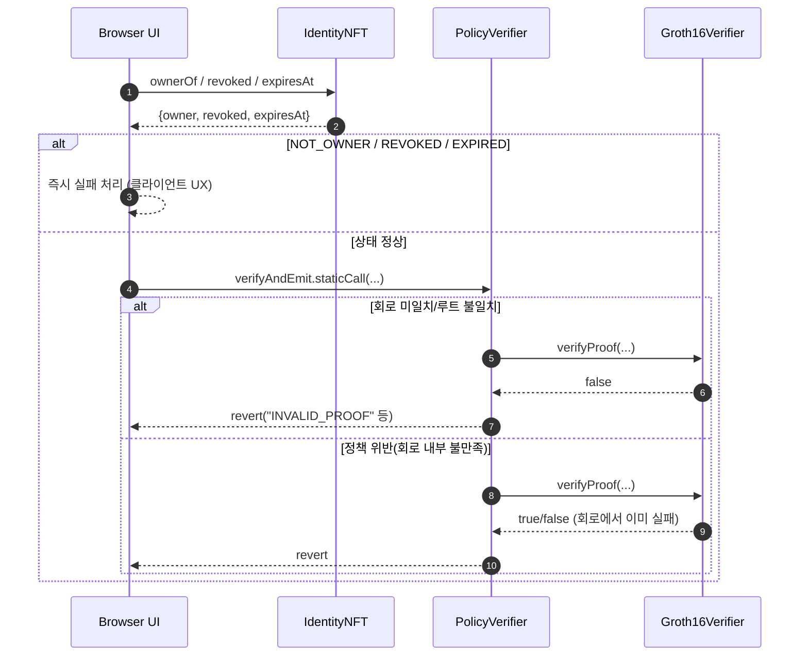

1) 전체 흐름(요약): 연결 → 루트계산/민팅 → 검증


2) 증명 생성 분기: (A) 브라우저에서 fullProve vs (B) 파일 업로드
 ```mermaid
sequenceDiagram
    autonumber
    actor User as User
    participant UI as Browser UI
    participant WASM as access_control.wasm/.zkey (HTTP)
    participant SNARK as snarkjs (browser)
    participant PV as PolicyVerifier
    participant Verifier as Groth16Verifier
    participant NFT as IdentityNFT

    Note over UI: 공통 준비: 정책/속성/솔트 입력, onchainRoot 조회/검증

    alt (A) 브라우저에서 증명 생성
        UI->>WASM: GET ../zk/access_control.wasm / .zkey
        WASM-->>UI: 파일 응답 (CORS 필요)
        UI->>SNARK: groth16.fullProve(input, wasm, zkey)
        SNARK-->>UI: { proof, publicSignals }
        UI->>SNARK: exportSolidityCallData(proof, publicSignals)
        SNARK-->>UI: calldata → a,b,c,inputs 파싱
    else (B) proof/public 업로드
        User->>UI: public.json, proof.json 업로드
        UI->>SNARK: exportSolidityCallData(proof, public)
        SNARK-->>UI: calldata → a,b,c,inputs 파싱
    end

    UI->>PV: verifyAndEmit.staticCall(...)
    PV->>Verifier: verifyProof(a,b,c,inputs)
    Verifier-->>PV: true
    PV-->>UI: static OK

    UI->>PV: verifyAndEmit(...) (tx)
    PV->>Verifier: verifyProof(a,b,c,inputs)
    PV->>NFT: attrCommitRoot(tokenId) == inputs[last]
    PV-->>UI: 이벤트 Verified(...)
```

1) 실패/예외 플로우(대표 케이스)
